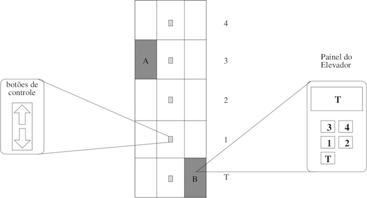

**Camilla Barreto de Sousa** 

### Programação Orientada a Objetos - POO29004

#### Engenharia de Telecomunicações

##### Instituto Federal de Santa Catarina

# Sistema de controle de elevadores

Faça um projeto para simular um sistema de controle de elevadores de um edifício. No exemplo da figura abaixo tem-se um edifício com 5 andares e 2 elevadores. Em cada andar existem botões para que o usuário possa chamar um elevador, indicando se ele deseja subir ou descer. Dentro do elevador o usuário poderá indicar para qual andar deseja ir. O elevador tem um visor que informa em qual andar ele está no momento.

## Regras para o sistema de controle

- Elevadores quando parados em um andar ficam com a porta aberta. Ou seja, o usuário já saberá que o elevador está ali e não precisará apertar o botão no andar para solicitar elevador
- Quando algum usuário requisita um elevador, deve-se deslocar o elevador que estiver parado mais próximo do andar onde foi feita a requisição
- Se dois ou mais elevadores estiverem parados a uma mesma distância do andar onde foi feita a requisição, então deve-se deslocar o elevador que fez um número menor de viagens
  - Se esses elevadores estiverem com o mesmo número de viagens, então deve-se deslocar o elevador que estiver imediatamente acima do andar onde o usuário está
- Para efeitos de simplificação, elevadores que estiverem se deslocando não precisarão atender pedidos
- Elevadores que atingiram 100 viagens deverão passar por uma revisão preventiva

## Com base no detalhamento acima, faça:

1. Identifique as classes necessárias e desenhe um diagrama de classes UML representando as classes e associações entre essas. Para cada classe é necessário indicar todos os atributos e somente os métodos essenciais para entendimento da classe
  1. O diagrama deverá ser entregue como uma figura PNG. Na raiz do repositório deve-se criar um arquivo [Resolucao.md](Resolucao.md) e fazer nesse uma referência para a figura do diagrama
2. Desenvolva um aplicativo Java (p. ex. Classe `Principal` com método `main`) com um menu interativo que permita ao usuário realizar as seguintes operações:
   1. Configurar o edifício
      1. O usuário deverá informar o número de andares do edífico e quantos elevadores esse edífico terá. Os edifícios deverão ter no mínimo 4 andares e no máximo 70. E o número de elevadores de ser de no mínimo 1 até 6.
   2. Solicitar elevador
      1. Simular o usuário estando em qualquer um dos andares do edifício e fazendo a solicitação de elevador a partir daquele andar
   3. Indicar um andar onde se deseja ir
      1. Simular o usuário dentro de um elevador específico e para este elevador informar o andar onde se deseja ir
   4. Imprimir estatísticas dos elevadores
      1. Imprimir todas as estatísticas pertinentes de cada elevador, por exemplo, andar atual, número de viagens.
   5. Listar quais elevadores precisam passar por uma revisão preventina. 
      1. Imprimir somente os dados dos elevadores que já fizeram no mínimo 100 viagens
   6. Sair do programa
